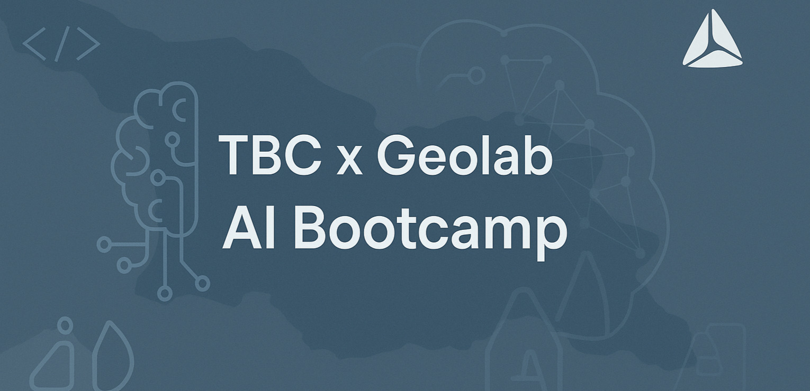

<div align="center">


# <samp>TBC x Geolab AI Bootcamp</samp>


### <samp>Foundational 3-month program on AI, Python, and real-world ML applications – developed by TBC Tech School & Geolab</samp>


</div>

---

## 📚 Course Overview

* **Type:** Foundational Certificate Program
* **Duration:** 3 Months
* **Lectures:** 20 (40 hours total)
* **Modules:** 4 thematic blocks + final project phase
* **Instructor:** Gurami Keretchashvili

### Learning Format

* Instructor-led interactive lectures
* Hands-on coding (Google Colab, Jupyter)
* Individual and group assignments
* Final project presentation

---

## 🧠 Key Topics

### ▶️ Module 1 – Introduction to Artificial Intelligence

* Fundamentals of AI, types, and history
* Real-world applications and challenges
* Foundations of machine learning

### ▶️ Module 2 – Programming with Python for AI

* Python basics and scripting
* Data structures and file I/O
* Data processing with Pandas, NumPy
* Data visualization using Matplotlib and Seaborn

### ▶️ Module 3 – Natural Language Processing (NLP)

* Text preprocessing and tokenization
* Vector representations (TF-IDF)
* Sentiment analysis using pre-trained models
* Interactive NLP apps with Streamlit or Gradio

### ▶️ Module 4 – Computer Vision

* Image reading and transformation
* Feature extraction and filtering
* Image classification with pretrained models
* Interactive visual AI tools

---

## 📂 Repository Structure

```ruby
introduction-to-ai/
├── flake.nix              # Development environment config
├── README.md              # Project overview
├── task-1/                
├── task-2/
├── task-3/
├── task-4/
├── task-5/
```

> 🗒️ *Each folder contains Markdown instructions (`task.md`) written in **Georgian** to reflect the local context of the course.*

If the project is intended for an international audience or GitHub portfolio use, it is recommended to include English translations or summaries for broader accessibility.

---

## ⚙️ Development Environment (planned via Nix)

Key dependencies:

* Python 3.11+
* JupyterLab / Google Colab
* Pandas, NumPy, Matplotlib, Seaborn
* Manim (visual explanation tools)

`flake.nix` support is planned for reproducible development environments.

---

## 📦 Data Usage

Since projects vary across modules, data sources and formats will be determined based on the topic and scope of each assignment. Students are encouraged to explore a range of resources including:

* Publicly available datasets
* National statistics
* Crowdsourced or manually collected data
* Web scraping and APIs (where appropriate)

> 🛠️ Flexibility is key — creativity and initiative in sourcing data are encouraged throughout the course.

---

## 🏁 Final Project

The program culminates in a capstone AI project, where students apply acquired knowledge to a real-world problem using data-driven AI techniques. Deliverables include:

* Problem analysis
* Model selection and justification
* Data sourcing and processing
* Visualizations and evaluation metrics
* Live or slide-based presentation

---

## 📜 License

This repository is maintained by students for educational purposes only. It is **not officially affiliated with or endorsed by TBC Tech School or Geolab**. All course materials and assignments are based on publicly available or student-generated content.

---
